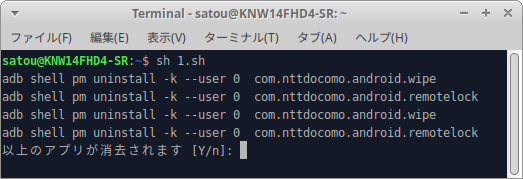

# Remove-CareerApp

通常削除できないキャリアアプリをまとめて消去することができます。
このスクリプトを実行するだけで簡単にクリーンなAndroid環境が作れます

# 依存関係

adbが必要です。

Debian系OSの場合下記コマンドで依存関係を解決できます。

sudo apt update && sudo apt install adb -y

# 実行する前に

アプリデータは完全に消去されるためキャリアからのサポートが受けられなくなる可能性があります。
このスクリプトを実行したことによる故障や損害について開発者は責任を負いかねます

# 実行の仕方

appremove.shを実行するとスクリプトが実行されます。

例:) bash appremove.sh

表示されたアプリ一覧に問題がなければ「Y」を入力します。

