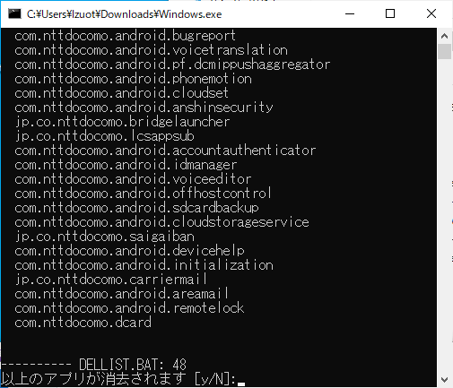

# Remove-CareerApp

通常削除できないキャリアアプリをまとめて消去することができます。
このスクリプトを実行するだけで簡単にクリーンなAndroid環境が作れます

# 対応OS

MacOSまたはDebian派生のOS. 
(Arm版MacOSは未検証です。使えるかわからない). 
依存関係は自動で解決されます  

Windowsを使用する方は予めdriverとplatform-toolsを  
導入してください。  
Windows版はここからダウンロード出来ます  
https://github.com/Aoi-Developer/remove-career-app/releases/tag/windows

# 実行する前に

アプリデータは完全に消去されるためキャリアからのサポートが受けられなくなる可能性があります。
このスクリプトを実行したことによる故障や損害について開発者は責任を負いかねます

# 実行の仕方

Android端末でUSBデバッグを有効にしパソコンへ接続します。

PCのターミナルでappremove.shを実行するとスクリプトが実行されます。  
(Windowsではexeをダブルクリック)

例:) bash <(curl -s https://raw.githubusercontent.com/Aoi-Developer/remove-career-app/main/appremove.sh)

表示されたアプリ一覧に問題がなければ「Y」と「Enter」を入力します。

以下コマンドを使用すればgitからcloneすることなく実行することも可能です
